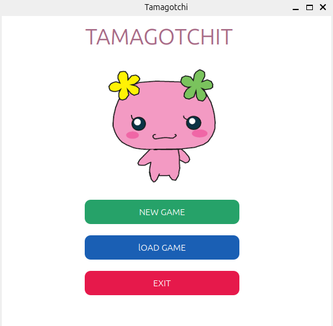
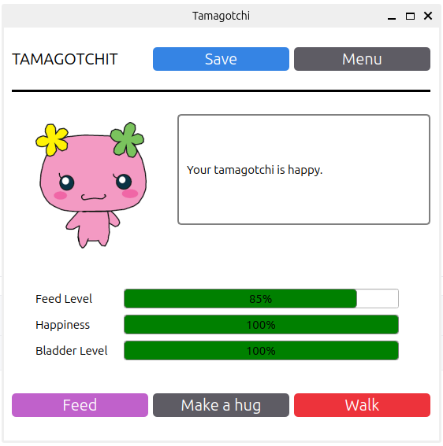

# Tamagotchi

Tamagotchi is an interactive application developed in **C++** with **Qt** to deliver a virtual pet simulation experience.

---

## 🔧 Features

- **🔄 New Game**: Start a brand-new game session.
- **💾 Save & Load**: Easily resume a saved game.
- **🌟 Interactive Actions**: Feed, hug, or walk your Tamagotchi to keep it happy.
- **📊 Stats Tracking**: Monitor hunger, happiness, and other indicators through an intuitive interface.

---

## 🔗 Prerequisites

Ensure you have the following before starting:

- **Qt** 6.2.4 or later [Download Qt](https://www.qt.io/download)
- **CMake** 3.27 or newer
- A compiler supporting **C++23**

---

## 🔢 Installation

Follow these steps to set up and run the project:

1. Clone the repository:
   ```bash
   git clone https://github.com/samaelpola/tamagotchi.git
   cd tamagotchi
   ```

2. Edit the `CMakeLists.txt` file:
   - Locate line 9:
     ```cmake
     set(CMAKE_PREFIX_PATH "/home/samael/Qt/6.2.4/gcc_64")
     ```
   - Replace `/home/samael/Qt/6.2.4/gcc_64` with the path where Qt is installed on your system.

3. Configure the project using **CMake**:
   ```bash
   cmake -S . -B build
   ```

4. Compile the project:
   ```bash
   cmake --build build
   ```

5. Run the application:
   ```bash
   ./build/tamagotchi
   ```

---

## 📃 Project Structure

- **main.cpp**: Entry point of the application.
- **Tamagotchi.cpp / Tamagotchi.h**: Handles the data and actions of the Tamagotchi.
- **mainwindow.cpp / mainwindow.h / mainwindow.ui**: Main interface.
- **gamewindow.cpp / gamewindow.h / gamewindow.ui**: Game interface.

---

## 📚 Usage

- **New Game**: Click `NEW GAME` to start a fresh game session.
- **Load Game**: Click `LOAD GAME` to continue an existing session.
- **Exit**: Click `EXIT` to close the application.

In-game, interact with your Tamagotchi:

- **🍽️ Feed**: Feed it to replenish its hunger level.
- **💖 Hug**: Increase its happiness with a hug.
- **🏃 Walk**: Take it for a walk to give it some exercise.

---

## 🖼 Screenshots

### Home Screen


### Game Interface
